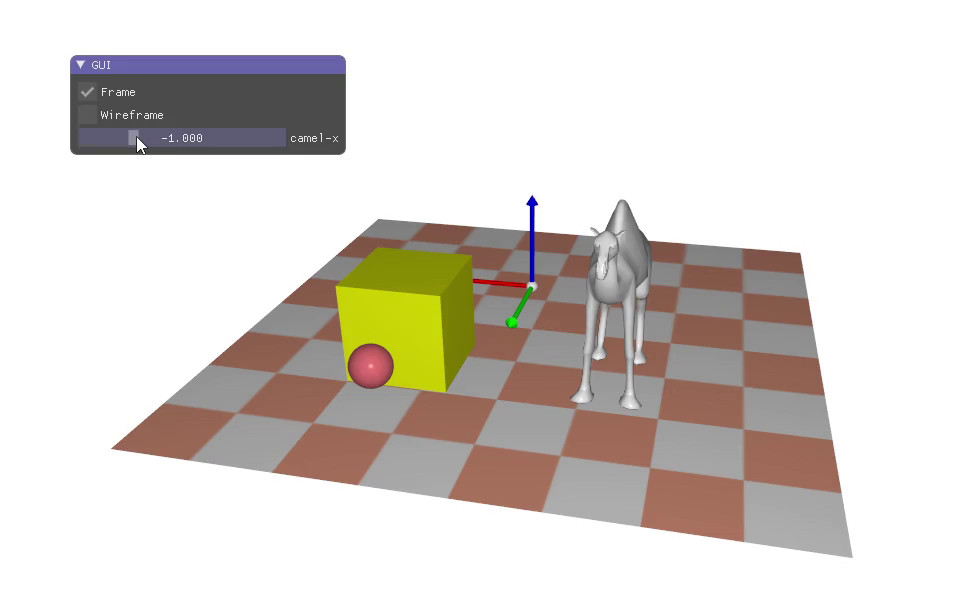

# LHTML Examples

Install LHTML (`pip install lhtml-markup`, or `pip install -e .` from the repository root), then run the examples from this directory:

```shell
lhtml example_1.l.html                  # HTML on stdout
lhtml example_1.l.html -o example_1.html
lhtml example_1.l.html -w               # Full HTML document
lhtml example_1.l.html example_video.l.html   # example_1.html, example_video.html
```


## example_1.l.html

Headings, a list and a styled div:

```
= Main Title

== Subtitle

* First point
* Second point
* Third point

::[color:red;]
This text should be red
::
```

`lhtml example_1.l.html` generates:

```html
<h1>Main Title</h1>


<h2>Subtitle</h2>


<ul>
<li>
First point
</li>
<li>
Second point
</li>
<li>
Third point
</li>
</ul>

<div style="color:red;">
This text should be red
</div>
```


## example_video.l.html

An image and a video. `videoplay::` adds `autoplay loop muted`, and the poster `assets/video-poster.jpg` is detected automatically next to `assets/video.mp4`:

```
img::assets/video-poster.jpg[width:400px;]

videoplay::assets/video.mp4[width:400px;]
```

`lhtml example_video.l.html` generates:

```html


<video autoplay loop muted style="width:400px;" poster="assets/video-poster.jpg">
	<source src="assets/video.mp4" type="video/mp4">
	 Cannot play video assets/video.mp4
</video>
```
